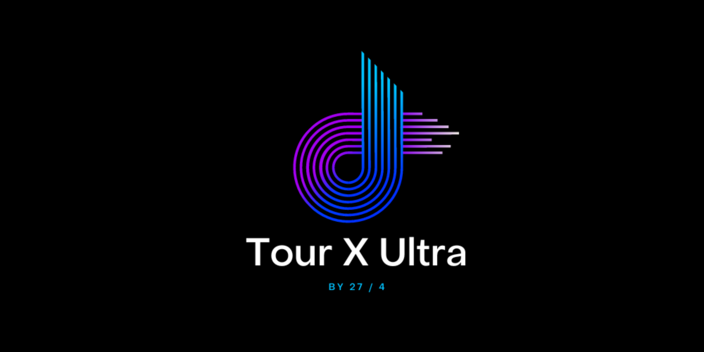
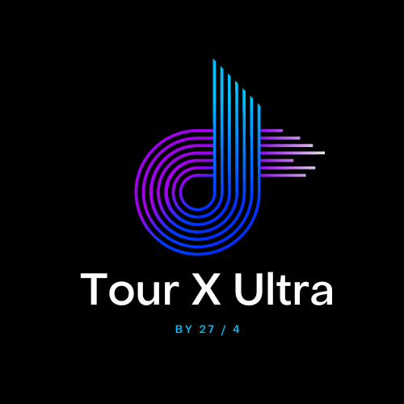

*©Dominik Englert, 2023<br>
©Artjom Moisejev, 2023<br>
Technikum Wien<br>
Software Engineering 2<br>
time-spent: ~ 120 h*

**If you have any question contact us on: https://27vier.com**

# Tour X Ultra

Tour X Ultra is a state of the art interactive hymne to javafx which is the best framework for modern UI/UX development.
Tour X Ultra let you create awesome tours with awesome maps of the tours. And if that was not enough you will even be able to add Tour logs for each tour.
For tours and logs you can do CRUD.



## Software architecture

The software architecture is divided mainly in three parts.

1. **Persistence:** Which contains the LogEntity and TourEntity as well as the corresponding Repositories.
2. **Service:** Which holds the LogService, TourService, SummarizeReportService, ImportExportService as well as their implementations. Moreover, you will find IO Services as well as the Input-validation service and a service to calculate the child-friendliness. Last but not least you will find the mapper to map from dtos to the entities and reverse.
3. **Presentation:** The last layer is the presentation layer which holds on the one hand all views and on the other hand their corresponding viewmodels. The different fxml objects are bidirectional binded with their corresponding properties in the viewmodels.

For example if you are adding a new tour: Your inputs will be bindet in the NewTourView to the corresponding properties in the NewTourViewModel. When saving the model function will call the tour service which will call the repository and finally save the new tour. It will then return the answer from the db back to service, to the viewmodel and eventually update the ListViewModel.

The other part is the resources folder which contains all the .fxml files for the different views. Each view.fxml is connected to a View - Class and to a View Model. Moreover you will find the .html file for thymeleaf to style and export PDFs which will help exporting the Summarized Report.

## DB Setup

Tour X Ultra runs on a postgres database. Since the software uses hibernate extension all you have to do is update the spring.datasource.url to the adress where your postgres db is running. You will find the Dockerfile in the source folder to create the neccessary image. The db will then automatically be initalized by the DatabaseInitializer.

```
FROM postgres:latest

ENV POSTGRES_USER=postgres
ENV POSTGRES_PASSWORD=pwd123456
ENV POSTGRES_DB=mydatabase

EXPOSE 5432
```

## Usage

To use Tour X Ultra just make sure that your db is up and running. Then execute the TourXUltraApplicationBoot and your App will start. You will find all the main features in the tabs at the top of the application. Make sure to use only valid city names for departure and arrival to get valid images of the mapquest api call.
To create a Summarized Report as a pdf just navigate in tabs to home and press the "Create & Export Summarized Report" Button. It will be then saved in your src folder as well.

## Bonus

The application includes an API call to GPT where you can get some basic inspiration. For that just navigation to home, fill out the city and a transport type of your choice and press the button. After some loading you will see the answer on the screen.

```
 public String requestGptResponse(String city, String transport) {
        String prompt = city + " " + transport;
        String requestBody = "{\"input\":[{\"role\":\"system\",\"content\":\"Schreib einen schnellen Satz für eine einfache Reise-Möglichkeit, basierend auf dem User-Input. Wenn möglich schlage ein Ziel für die Fahrt vor. Maximal 20 Wörter.\"},{\"role\":\"user\",\"content\":\"" + prompt + "\"}]}";
        MediaType mediaType = MediaType.parse("application/json");
        OkHttpClient client = new OkHttpClient.Builder().connectTimeout(100, TimeUnit.SECONDS)
                .build();
        Request request = new Request.Builder().url(GPT_API_ENDPOINT).post(RequestBody.create(requestBody, mediaType)).build();
        try {
            Response response = client.newCall(request).execute();
            System.out.println(response);
            if (response.isSuccessful()) {
                String jsonResponse = response.body().string();
                System.out.println("API response:\n" + jsonResponse);
                return getContentFromApiResponse(jsonResponse);
            } else {
                System.out.println("API request failed. Response code: " + response.code());
                return "Something went wrong. Please try again.";
            }
        } catch (Exception e) {
            System.out.println("An error occurred: " + e.getMessage());
        }
        return "Something went wrong. Please try again.";
    }
```

### Unit Tests

The application includes many basic unit test which will make sure, that the main features will run as intended. On the one hand there are some builder tests, tests for the repositories (caution - they will delete all database entries - make sure to not connect to production database), Tests for the API Calls, It will also test the child-friendliness-calculation, and the input validation.

### Known Bugs

1. Since this is java fx and really NOBODY cares about it - the UI will be blocked when double click on a tour, since the image will be downloaded in the background. Also when using the inspiration feature with GPT it will take some time until the UI will be unblocked again.
2. When exporting a tour, then delete it and then import it via JSON file again you will run into databse issues when adding a new log since the imported ID will not be the same then in database.

